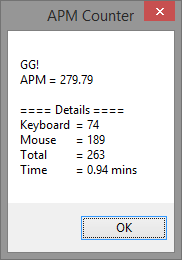

# APM Counter

This is an autohotkey script for counting APM `Actions Per Minute`.

The script records keyboard strikes and mouse clicks. 

1. Install [Autohotkey](https://autohotkey.com/)
2. Double click `apm-counter.ahk` to start.
  - Press `F11` to start counting.
  - Press `F12` to see current statics.

Feel free to share to your gaming mates if you like it!

